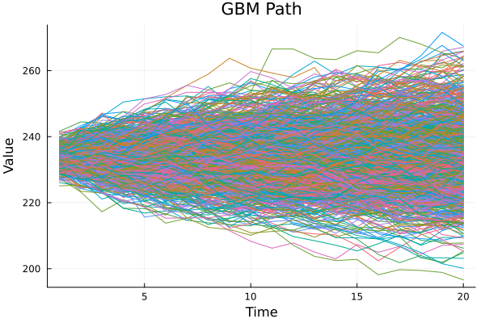
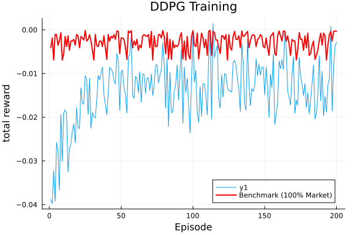
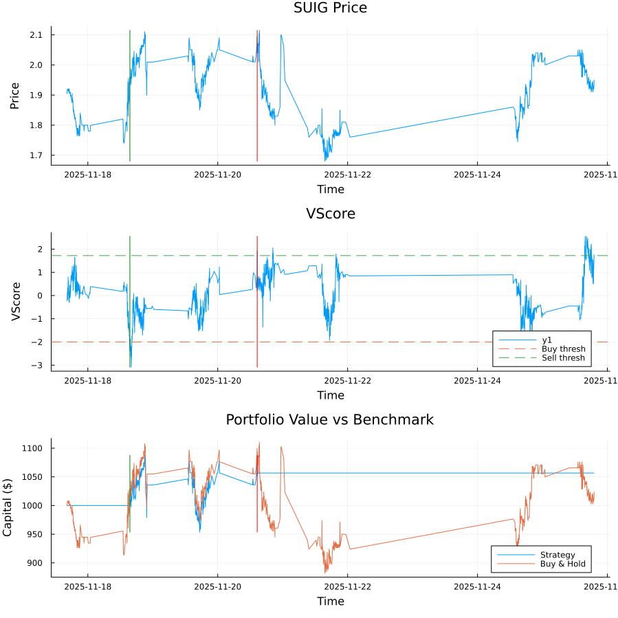

# QuantJL

**Deep Reinforcement Learning for Algorithmic Trading. In Julia, from scratch.**

[](https://julialang.org/)
[](LICENSE)
[]()

## Introduction

QuantJL is a sophisticated algorithmic trading system that uses Deep Deterministic Policy Gradient (DDPG) reinforcement learning to optimize stock trading strategies. The system learns to make optimal trading decisions by analyzing minute-level intraday market data and technical indicators to maximize return on investment while managing risk.

### Problem Statement

Traditional trading strategies often rely on static rules or simple technical indicators that fail to adapt to changing market conditions. QuantJL addresses this by implementing a continuous control reinforcement learning agent that learns optimal trading policies through interaction with market data. The agent determines whether to **hold (0)** or **long (1)** positions based on the state of the market over the last 20 minutes of multiple technical indicators.

### Results
Unfortunately, the average reward from each episode seems to plateau at around -0.01 cents, which I believe to be largely due to transaction costs. This behavior is consistent with minute-level intraday environments in which transaction costs dominate per-timestep returns. Because the RL agent must output an action every single minute, even small position adjustments generate cumulative friction that overwhelms micro-profits.


However, the brownian motion indicator later discussed the **vscore formulation** part of this readme, shows promise, as the movement of an asset changes direction after a critical value. For example, we take a long position on an asset if the vscore goes below -2, and sell it after it goes above +2. The following is one of many example backtests done on this strategy.


**However**, the backtests enforce a **trade-cooldown of ten minutes** while the reinforcement learning algorithm does not. 
This throttling drastically reduces transaction costs and prevents repeated oscillation around the threshold. Consequently:

* The strategy trades only when the signal is strong,
* avoids noise-driven whipsaws, and
* pays transaction costs orders of magnitude less frequently than the RL agent.

## Key Features

- **Deep Deterministic Policy Gradient (DDPG)** implementation for continuous action spaces
- **minute-level intraday trading** support with minute-level data processing
- **Custom technical indicators** including V-scores, RSI, EMA, MACD, Bollinger Bands, and VWAP
- **Risk management** with volatility penalties and capital protection mechanisms
- **Experience replay** with prioritized sampling for stable learning
- **Target networks** for stable training with soft updates
- **Ornstein-Uhlenbeck noise** for exploration during training
- **Comprehensive visualization** tools for monitoring training progress

## Architecture Overview

QuantJL implements a Deep Deterministic Policy Gradient (DDPG) algorithm, a model-free, off-policy actor-critic method for continuous control. The architecture consists of four neural networks working in tandem to learn optimal trading policies.

### Core Components

**Actor Network (π)**: A deterministic policy network that maps market states to trading actions. The network takes as input the last 20 minutes of technical indicators plus current capital and outputs a continuous action value between 0 and 1 (hold to long).

**Critic Network (Q)**: A Q-value network that evaluates state-action pairs. It takes both the market state and the action as input and outputs the expected return for that state-action combination.

**Target Networks**: Separate target networks (π_target, Q_target) for both actor and critic to provide stable learning targets and reduce training instability through soft updates.

**Experience Replay Buffer**: Stores past experiences (state, action, reward, next_state, done) with uniform sampling for efficient learning from diverse experiences.

### DDPG Algorithm Pseudocode

Based on OpenAI Spinning Up's DDPG implementation:

```python
# DDPG Algorithm Pseudocode
def ddpg_algorithm():
    # Initialize networks
    π, Q = initialize_networks()
    π_target, Q_target = copy_networks(π, Q)
    replay_buffer = ReplayBuffer()
    
    for episode in range(num_episodes):
        state = environment.reset()
        episode_reward = 0
        
        for t in range(max_timesteps):
            # Select action with exploration noise
            action = π(state) + noise()
            action = clip(action, action_low, action_high)
            
            # Execute action in environment
            next_state, reward, done = environment.step(action)
            
            # Store experience
            replay_buffer.store(state, action, reward, next_state, done)
            
            # Update networks
            if len(replay_buffer) > batch_size:
                batch = replay_buffer.sample_batch(batch_size)
                
                # Update critic
                Q_target_values = Q_target(next_state, π_target(next_state))
                y = reward + gamma * (1 - done) * Q_target_values
                Q_loss = MSE(Q(state, action), y)
                Q.update(Q_loss)
                
                # Update actor
                π_loss = -Q(state, π(state)).mean()
                π.update(π_loss)
                
                # Soft update target networks
                soft_update(π_target, π, tau)
                soft_update(Q_target, Q, tau)
            
            state = next_state
            episode_reward += reward
            
            if done:
                break
```

### Mathematical Formulation

**Policy Gradient**: The actor network is updated using the deterministic policy gradient:

$$\nabla_{\theta_{\pi}} J \approx \mathbb{E}_{s \sim \rho^{\beta}} \left[ \nabla_{\theta_{\pi}} Q(s, a| \theta_Q) \big|_{a=\pi(s|\theta_{\pi})} \nabla_{\theta_{\pi}} \pi(s|\theta_{\pi}) \right]$$

**Q-Learning Update**: The critic network is updated using the Bellman equation:

$$y_i = r_i + \gamma Q'(s_{i+1}, \pi'(s_{i+1}|\theta_{\pi'})|\theta_{Q'})$$

$$L = \frac{1}{N} \sum_i (y_i - Q(s_i, a_i|\theta_Q))^2$$

**Soft Target Updates**: Target networks are updated using exponential moving averages:

$$\theta_{Q'} \leftarrow \tau \theta_Q + (1-\tau) \theta_{Q'}$$

$$\theta_{\pi'} \leftarrow \tau \theta_{\pi} + (1-\tau) \theta_{\pi'}$$

### State Space

The state representation combines multiple technical indicators:

$$s_t = [v_{t-19:t}, c_t] \in \mathbb{R}^{101}$$

Where:
- $v_{t-19:t}$: V-scores for the last 20 minutes (100 dimensions)
- $c_t$: Log-transformed current capital (1 dimension)

### Action Space

Continuous action space representing position sizing:

$$a_t \in [0, 1]$$

Where:
- $a_t = 0$: Hold (no position)
- $a_t = 1$: Long position (full capital allocation)

### Reward Function

The reward function incorporates multiple risk management components:

$$
r_t = \text{rawReturn}_t - \text{riskPenalty}_t - \text{capitalPenalty}_t
$$
$$
\text{rawReturn}_t = a_t \cdot \text{capitalAllocation}_t \cdot
\frac{\text{priceChange}_t}{100}
$$
$$
\text{riskPenalty}_t = \lambda_{\text{risk}} \cdot \sigma(\text{recentReturns})
$$
$$
\text{capitalPenalty}_t =
\begin{cases}
  0.2 \cdot \dfrac{1000 - \text{capital}_t}{1000}, & \text{if } \text{capital}_t < 1000 \\
  0, & \text{otherwise}
\end{cases}
$$

**Key Insight**: During initial experiments, when trading penalties were set too high, the actor network learned to avoid making any movements whatsoever, effectively learning a "do nothing" policy. This highlights the importance of carefully balancing risk penalties with trading incentives to encourage active learning while maintaining risk management.

### V-Score Mathematical Formulation

The V-score is a custom volatility indicator based on Monte Carlo simulation of Geometric Brownian Motion (GBM):

**GBM Process**:
$$S_{t+\Delta t} = S_t \exp\left(\left(\mu - \frac{\sigma^2}{2}\right)\Delta t + \sigma \sqrt{\Delta t} \cdot Z\right)$$

Where:
- $S_t$: Current stock price
- $\mu$: Drift parameter (estimated from historical returns)
- $\sigma$: Volatility parameter (estimated from historical returns)
- $Z \sim \mathcal{N}(0,1)$: Standard normal random variable

**V-Score Calculation**:
$$V_t = \frac{\text{count}(\text{simulatedPaths} > S_t) - \text{expectedCount}}
           {\text{std}(\text{countDistribution})}$$


The V-score represents how many simulated future paths exceed the current price, normalized by the distribution's standard deviation.

### Key DDPG Aspects

**State Representation**: The state space combines temporal market information (V-scores) with current capital position, providing the agent with both market context and portfolio state information.

**Action Space**: Continuous actions allow for nuanced position sizing rather than discrete buy/sell decisions, enabling more sophisticated trading strategies.

**Reward Design**: The multi-component reward function balances profit maximization with risk management, preventing the agent from learning overly conservative or aggressive strategies.

**Exploration Strategy**: Ornstein-Uhlenbeck noise provides correlated exploration that maintains temporal consistency in action selection while encouraging exploration.

**Target Networks**: Soft updates to target networks provide stable learning targets, preventing the instability common in direct policy gradient methods.

**Experience Replay**: Uniform sampling from the replay buffer ensures the agent learns from diverse market conditions and prevents catastrophic forgetting.

### Architecture Diagram

```
┌─────────────────┐
│   Market Data   │  (OHLCV)
└─────────────────┘
         │
         ▼
┌─────────────────────────────┐
│     Feature Engineering     │
│  (Indicators + V-Scores)    │
└─────────────────────────────┘
         │
         ▼
      state s_t
         │
         ├─────────────────────────────┐
         ▼                             │
┌─────────────────┐                    │
│   Actor π(s_t)  │────────────────────┤  action a_t (0–1) + OU noise
└─────────────────┘                    │
         │                             │
         ▼                             │
┌─────────────────────────────┐        │
│        Environment          │◀───────┘
│  (apply a_t, get r_t, s′)   │
└─────────────────────────────┘
         │
         ▼
(Store transition)
(s_t, a_t, r_t, s′, d_t)
         │
         ▼
┌─────────────────────────────┐
│       Replay Buffer         │
└─────────────────────────────┘
         │         │
   sample▼         ▼sample
┌─────────────────┐   uses targets for y = r + γ(1–d)Q⁻(s′,π⁻(s′))
│  Critic Q(s,a)  │<───────────────────────────────────────────────┐
└─────────────────┘                                                │
    ▲     │ backprop MSE on (Q – y)                                │
    │     └────────────────────────────────────────────────────────┘
    │                                        targets
    │                          ┌───────────────────────────────────┐
    │                          │                                   │
    │                   ┌───────────────┐                    ┌───────────────┐
    │                   │  Target Q⁻    │◀── soft update ───▶│     Q         │
    │                   └───────────────┘                    └───────────────┘
    │
    │ policy gradient via ∇_a Q(s, a)|_{a=π(s)}
    │
    │     ┌───────────────────────────────────────────────────────────────┐
    │     │  g = (∂Q/∂a) at (s, π(s));  backprop through Actor with –g   │
    │     ▼                                                               │
┌─────────────────┐                                                       │
│   Actor π(s)    │<──────────────────────────────────────────────────────┘
└─────────────────┘
    ▲                                   targets
    │                   ┌───────────────┐                    ┌───────────────┐
    │                   │  Target π⁻    │◀── soft update ───▶│     π         │
    │                   └───────────────┘                    └───────────────┘
    │
    └── (next step uses updated π to act)

```

## Getting Started

### Prerequisites

- **Julia 1.8+** ([Download](https://julialang.org/downloads/))
- **Python 3.7+** (for data downloading)
- **Financial Modeling Prep API key** ([Get API key](https://financialmodelingprep.com/))
- **Git** for version control

### Installation

1. **Clone the repository**:
   ```bash
   git clone https://github.com/Sentientplatypus/quantjl.git
   cd quantjl
   ```

2. **Install Julia dependencies**:
   ```julia
   using Pkg
   Pkg.add(["CSV", "DataFrames", "Statistics", "Dates", "Plots", "UnicodePlots", "Test", "Random", "StatsBase"])
   ```

3. **Install Python dependencies**:
   ```bash
   pip install pandas certifi
   ```

4. **Set up API key**:
   ```bash
   echo "your_api_key_here" > apikey
   ```

### Environment Variables

Create a `.env` file (optional):
```bash
FMP_API_KEY=your_api_key_here
DATA_DIR=./data
PLOTS_DIR=./plots
```

## Quickstart

### Download Market Data

```bash
# Download minute-level intraday data for Microsoft (MSFT) for the past 30 days
python download.py MSFT
```

### Run Training

```julia
# Start Julia REPL
julia

# Include the main training script
include("test/quantgbm.jl")
```

### Minimal Example

```julia
using Random
include("quant.jl")
include("data.jl")

# Set random seed for reproducibility
Random.seed!(3)

# Create neural networks
π_ = Net([Layer(101, 80, relu, relu′),
          Layer(80, 64, relu, relu′),
          Layer(64, 32, relu, relu′),
          Layer(32, 16, relu, relu′),
          Layer(16, 1, idty, idty′)], mse_loss, mse_loss′)

Q̂ = Net([Layer(102, 80, relu, relu′),
         Layer(80, 64, relu, relu′),
         Layer(64, 32, relu, relu′),
         Layer(32, 16, relu, relu′),
         Layer(16, 1, idty, idty′)], mse_loss, mse_loss′)

# Initialize DDPG agent
quant = Quant(π_, Q̂, 0.95, 0.009)

# Get market data
price_data = get_historical("MSFT")
vscores = get_historical_vscores("MSFT")

# Training loop (simplified)
for episode in 1:100
    # ... training logic ...
end
```

## Configuration

### Network Architecture

The default network configuration can be modified in the test files:

```julia
# Actor network: 101 → 80 → 64 → 32 → 16 → 1
π_ = Net([Layer(101, 80, relu, relu′),
          Layer(80, 64, relu, relu′),
          Layer(64, 32, relu, relu′),
          Layer(32, 16, relu, relu′),
          Layer(16, 1, idty, idty′)], mse_loss, mse_loss′)

# Critic network: 102 → 80 → 64 → 32 → 16 → 1
Q̂ = Net([Layer(102, 80, relu, relu′),
         Layer(80, 64, relu, relu′),
         Layer(64, 32, relu, relu′),
         Layer(32, 16, relu, relu′),
         Layer(16, 1, idty, idty′)], mse_loss, mse_loss′)
```

### Training Parameters

Key hyperparameters can be adjusted:

```julia
γ = 0.95          # Discount factor
τ = 0.009         # Target network update rate
α_Q = 0.0001      # Critic learning rate
α_π = 0.0001      # Actor learning rate
λ = 64            # Regularization parameter
batch_size = 64   # Training batch size
```

## Data & Preprocessing

### Data Sources

- **Financial Modeling Prep API**: minute-level intraday (1-minute) and historical data
- **Supported tickers**: MSFT, AAPL, NVDA, PLTR, SPY, and more
- **Data format**: CSV files with OHLCV data and calculated percentage changes

### Data Directory Layout

```
data/
├── 2025-06-14/          # Date-based directories
│   ├── MSFT_day1.csv    # Daily minute-level intraday data
│   ├── MSFT_day2.csv
│   └── ...
├── MSFT.csv             # Historical data
├── AAPL.csv
└── merge.csv            # Combined historical data
```

### Preprocessing Commands

```bash
# Download historical data
python download.py MSFT AAPL NVDA

# Download minute-level intraday data for past 30 days
python download.py MSFT
```

### Technical Indicators

The system calculates multiple technical indicators:

- **V-Scores**: Custom volatility scoring using Monte Carlo simulation
- **RSI**: Relative Strength Index (14-period)
- **EMA**: Exponential Moving Average (14-period)
- **MACD**: Moving Average Convergence Divergence
- **Bollinger Bands %B**: Bollinger Band position indicator
- **VWAP**: Volume Weighted Average Price
- **Time-of-day features**: Cyclical encoding of trading hours

## Training

### Single-GPU Training

```julia
# Run the main training script
include("test/quantgbm.jl")
```

### Training Configuration

```julia
LOOK_BACK_PERIOD = 100    # Number of historical data points
NUM_EPISODES = 200        # Training episodes
INITIAL_CAPITAL = 1000.0  # Starting capital
MIN_CAPITAL = 650.0       # Episode termination threshold
```


The system automatically saves:
- Training progress plots in `plots/` directory
- Capital distribution analysis
- Action trajectory visualizations

## Evaluation & Benchmarks

### Performance Metrics

The system tracks several key metrics:

- **Total Return**: Cumulative profit/loss over episodes
- **Sharpe Ratio**: Risk-adjusted returns
- **Maximum Drawdown**: Largest peak-to-trough decline
- **Win Rate**: Percentage of profitable trades
- **Capital Preservation**: Ability to maintain initial capital

### Benchmark Comparison

Results are compared against:
- **Buy & Hold**: Keeping 100% of capital invested in the market at all times
- **Random Trading**: Random action selection with uniform distribution
- **Technical Indicators**: Traditional technical analysis strategies

### Reproducing Results

To reproduce the published results:

```julia
# Set random seed
Random.seed!(3)

# Use default configuration
include("test/quantgbm.jl")

# Results will be saved to plots/ directory
```

## Monitoring & Experiment Tracking

### Visualization Tools

The system provides comprehensive visualization:

```julia
# Visualize neural network activations
include("test/visualize.jl")
visualize_net(net, input_vector)

# Plot training progress
plot(capitals, title="Capital over time")
plot(actions, title="Actions over time")
```

### Output Files

Training generates several visualization files:
- `plots/total_rewards.png`: Training reward progression
- `plots/capital_distribution/`: Episode-by-episode capital analysis
- `plots/better_rewards.png`: Reward function analysis

## Security, Privacy & Responsible AI

### Data Privacy

- **API Keys**: Stored locally in `apikey` file (excluded from version control)

### Performance Considerations

- **Training Time**: Full training can take several hours on CPU
- **Memory Requirements**: Requires sufficient RAM for replay buffer
- **Data Storage**: minute-level intraday data requires significant disk space

## Roadmap
- [ ] **Short Selling Support**: Extend action space to include short positions (-1)
- [ ] **Multi-Asset Training**: Implement portfolio-level optimization
- [ ] **Transaction Costs**: Add realistic trading costs to reward function
- [ ] **Hyperparameter Optimization**: Automated hyperparameter tuning
- [ ] **GPU Support**: CUDA acceleration for faster training

## Contributing

We welcome contributions! Please see our [Contributing Guidelines](CONTRIBUTING.md) for details.

### Development Setup

1. Fork the repository
2. Create a feature branch
3. Make your changes
4. Add tests for new functionality
5. Submit a pull request

## License

This project is licensed under the MIT License - see the [LICENSE](LICENSE) file for details.

## Disclaimer

**This software is for educational and research purposes only. It is not intended for live trading or investment advice. Trading financial instruments involves substantial risk of loss and is not suitable for all investors. Past performance does not guarantee future results.**

## Acknowledgments

- Financial Modeling Prep for market data API
- OpenAI Spinning Up DDPG page.

---

For questions, issues, or contributions, please open an issue or contact the maintainers.


